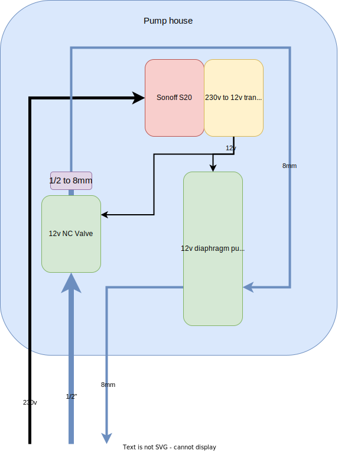
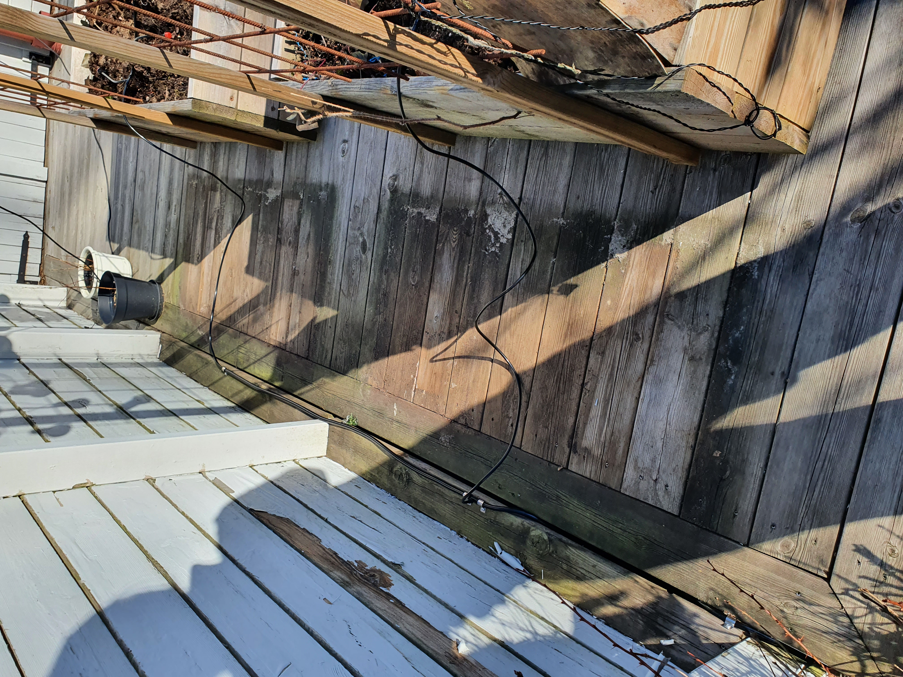
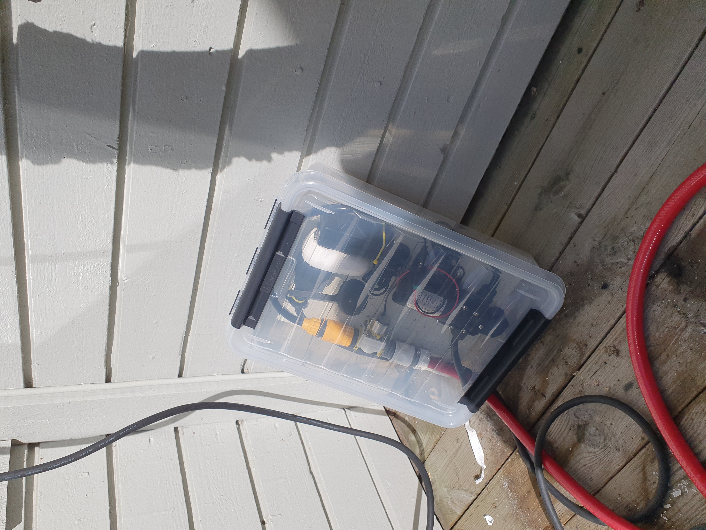
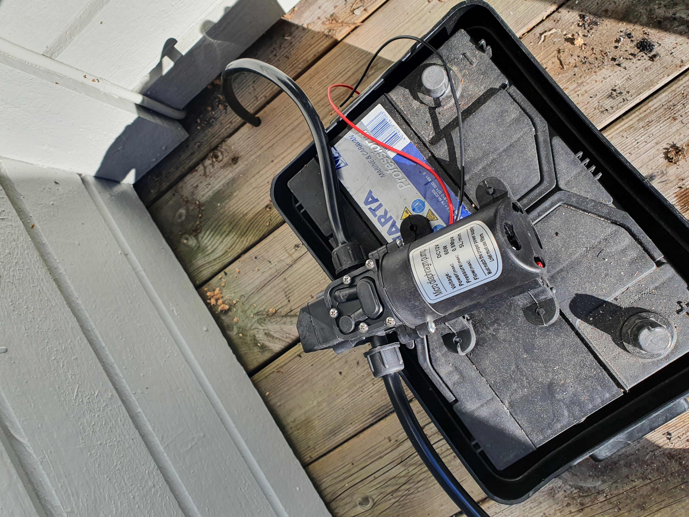

# mojster
Schematics, BOM and documentation of our backyard irrigation system.

  

## Bill of material

The irrigation system consists of the following main parts:

* **Downpipe rain collector** 
  https://www.amazon.se/gp/product/B00BXZ4PUM/ref=ppx_yo_dt_b_asin_title_o02_s00?ie=UTF8&psc=1

* **200L barrel** 
  Example: https://www.alibaba.com/product-detail/Plastic-Barrel-Drum-200-Litre-HDPE_60427542712.html 
  Better: Ask around at your local shops

* **Pump house** 
  See specs below

* **Hoses and nozzles** 
  https://www.styrahem.se/p/422/bevattningssystem-pro-25-enheter 
  https://www.styrahem.se/p/505/slang-8mm-3m 
  https://www.styrahem.se/p/506/slangkoppling-rak-8mm

### Pump house
Contains the following components:

* 12v NC valve 
  https://www.styrahem.se/p/385/ventil-for-vattenstyrning-12v-normalt-stangd

* 12v diaphragm pump 
  https://www.amazon.se/gp/product/B07W483KMZ/ref=ppx_yo_dt_b_asin_title_o01_s00?ie=UTF8&psc=1

* Sonoff S20 
  https://itead.cc/product/sonoff-s26r2-wifi-smart-plug-eu-br-uk/

* 230v to 12v transformer 
  https://www.styrahem.se/p/516/natadapter-12v-3a

  

  
   

  

## Installation

  
   

  
   

  
   

## License
See [LICENSE](./LICENSE)